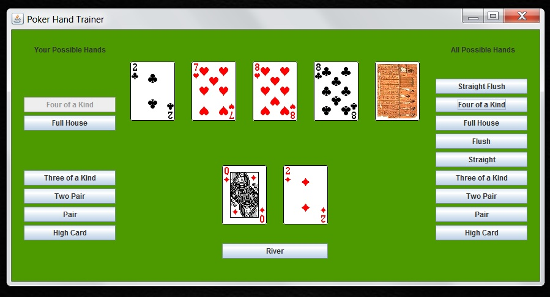

# Poker Trainer

Poker Trainer is a Java Applet developed by David Parsons in order to help those new to Poker learn about the different hands and how to recognize them.

The intention of this project is to develop a simple easy to use Applet for learning the different Poker Hands of Classic Texas Hold'em.

Users will be shown/dealt the two initial cards that make up their hand. Then during each of the dealing stages, the user will be asked to eliminate the final poker hands that they could not possibly end with.

After all three rounds, the user is given a report about the correctness of their assumptions during the stages.

## Coming Soon - As of January 2017

- Create release version for non-developers (i.e. create jar & start-up guide).

- Create Web Port using JApplet.

- Add support for multiple hands in order to simulate other players.

- Advance mode that prompts user for probabilities for each hand.

## Preview

